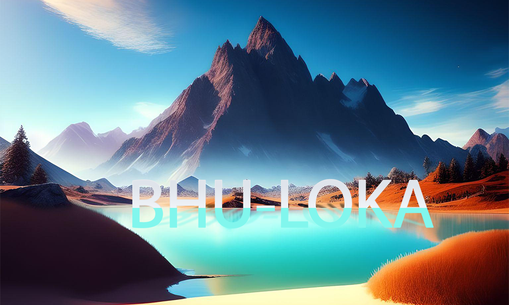
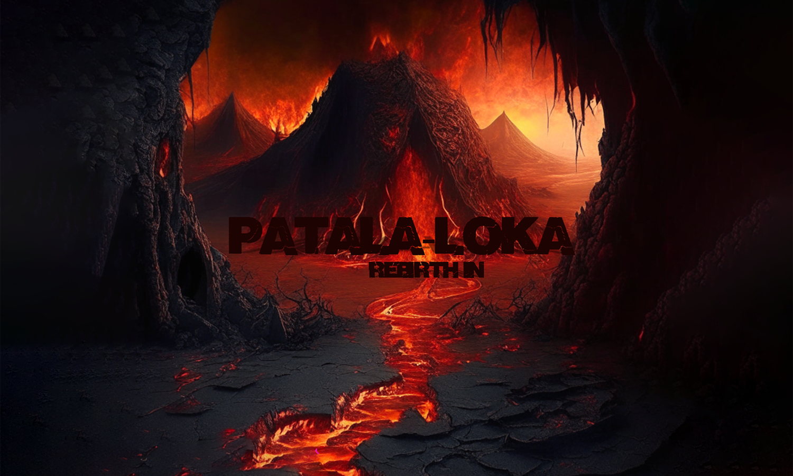

## Description
This project is a game completely made using C. The game is "Odyssey of Life", a multi-levelled game of three levels, which revolves around your punya gained(points scored) and 3 lokas i.e. bhu-loka , pathal-loka, swarg-loka. You start the game in bhu-loka and based on your punya you either get promoted to swarg-lok or get demoted to pathal-lok. There
are some virtuous objects which increase your punya and also there are some bad objects which can decrease your punya. 

## Libraries
OpenGL and OpenAL are the two libraries which are used in making the project. OpenGL is a graphics library which is and abstarct API to draw 2D and 3D graphics and OpenAL is an environmental 3D audio library which is cross-platform audio API.
The header files used under OpenGL library are glut,gl,glew,glu and under OpenAL, header files used are al,alc,alext and alut. Except these header files used are sndfiile and pthread.

## Installation instructions 
For cloning repository- git clone 

For libraries installation
- For OpenGl :
  sudo apt install mesa-utils libgl1-mesa-dev
- For glut :
  sudo apt install freeglut3-dev
- For glew :
  sudo apt install libglew-dev
- For OpenAL :
  sudo apt install libopenal-dev
- For alut :
  sudo apt install libalut-dev
- For sndfile :
  sudo apt install libsndfile1-dev
- For soil :
  sudo apt-get install libsoil-dev
  
  
  Compiling the file
  
  gcc -o final final.c -lglut -lGL -lGLEW -lGLU -lglfw -lm -lSOIL -lpthread -lopenal -lsndfile -lalut
  
 ## 
  
  

  
  
  
  
